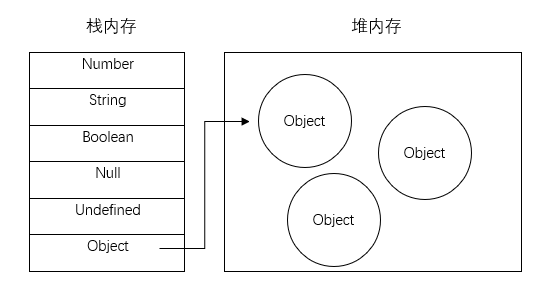

# JS小记
Created: 2018-07-26  
Last Modified: 2018-10-14

## 函数默认参数
```
ES5:
function func(arg) {
  arg = (typeof arg !== 'undefined') ? arg : defaultValue
}
ES6:
function func(arg = defaultValue) {}
```

## 取整小记
因为JavaScript里面都是浮点数，所以有时候运算操作需要取整操作
- 四舍五入 `Math.round()`
- 向上取整 `Math.ceil()`
- 向下取整 `Math.floor()`
- 向下取整 `~~` (参见常用位运算)
- 向下取整 `parseInt()` (可以用来取整，但定义是解析字符串，返回整数 [详见](https://developer.mozilla.org/en-US/docs/Web/JavaScript/Reference/Global_Objects/parseInt))

## 常用的位运算
```
const VAL  = '3.1415'
var string = '' + VAL  // to String
var int    = ~~VAL     // to integer
var float  = 1*VAL     // to float
var bool   = !!VAL     // to boolean
var array  = [VAL]     // to array
```

## 隐式转换
隐式转换Boolean false值只有: `undefined`, `null`, `""`(空字符串), `0`, `-0`, `NaN` 

## 变量存储方式-栈(stack)和堆(heap)
栈：自动分配内存空间，系统自动释放，里面存放的是基本类型的值和引用类型的地址  
堆：动态分配内存，大小不定，不会自动释放，里面存放的引用类型的值  
  

## Array.includes处理多重条件
```
function func(arg) {
  if (arg === 'A' || arg === 'B' || arg === 'C') { /* do something */ }
}

function func(arg) {
  const arr = ['A', 'B', 'C'];
  if (arr.includes(arg)) { /* do something */ }
}
```

## Array.every和Array.some处理全部/部分满足条件
```
const arr = [
  { name: 'AA', age: 10 },
  { name: 'BB', age: 20 },
  { name: 'CC', age: 30 }
]

// 满足全部条件
const bool = arr.every(item => item.name === 'AA');

// 满足部分条件
const bool = arr.some(item => item.age < 35);
``` 