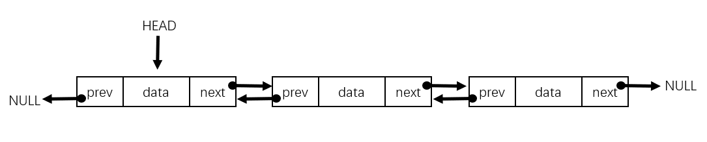

# 双向链表( Doubly Linked List )
Created: 2018-08-27
Last Modified: 2018-08-28

双向链表（双链表），每个结点包含两个指针，分别指向当前结点的直接前驱和直接后继。所以，可以从表中的任意结点出发，访问它的前驱结点和后继结点。头结点的前驱和尾结点的后继分别指向NULL。


与单链表对比:
- 能够方便地向前，向后遍历
- 提供相应的结点，插入删除时更有效
- 每一个结点需要额外的内存保存前驱指针。
- 所有的操作需要更多的一个指针。

```
//==========
// 结构体
//==========
struct Node {
  int data;
  struct Node* next;
  struct Node* prev;
}

//============================
// 创建新的结点，返回其指针
//============================
struct createNode(int data) {
  struct Node* temp = (struct Node*)malloc(sizeof(struct Node));
  temp->data = data;
  temp->prev = NULL;
  temp->next = NULL;
  return temp;
}

//============================
// 插入结点--在前面插入结点
//============================
void push(struct Node **head, int data) {
  struct Node* temp = (struct Node*)malloc(sizeof(struct Node));
  temp->data = data;
  temp->next = (*head);
  temp->prev = NULL;
  if((*head) != NULL) {
    (*head)->prev = temp;
  }
  (*head) = temp;
}

//==========================
// 插入结点--在末尾插入结点
//==========================
void append(struct Node** head, int data) {
  struct Node* temp = (struct Node*)malloc(sizeof(struct Node));
  struct Node* last = *head;
  temp->data = data;
  temp->next = NULL;
  if(*head == NULL) {
    temp->prev = NULL;
    *head = temp;
    return;
  }
  while(last->next != NULL) {
    last=last->next;
  }
  last->next = temp;
  temp->prev = last;
  return;
}

//==================================
// 插入结点--在指定结点之后插入结点
//==================================
void insertAfter(struct Node* refNode, int data) {
  if(refNode == NULL) {
    return;
  }
  struct Node* temp = (struct Node*)malloc(sizeof(struct Node));
  temp->data = data;
  temp->next = refNode->next;
  refNode->next = temp;
  temp->prev = refNode;
  if(temp->next != NULL) {
    temp->next->prev = temp;
  }
}

//==================================
// 插入结点--在指定结点之前插入结点
//==================================
void insertBefore(struct Node* refNode, int data) {
  if(refNode == NULL) return;
  struct Node* temp = (struct Node*)malloc(sizeof(struct Node));
  temp->data = data;
  temp->prev = refNode->prev;
  refNode->prev = temp;
  temp->next = refNode;
  if(temp->prev != NULL) {
    temp->prev->next = temp;
  }
}

//========================
// 删除结点--指定删除结点
//========================
void deleteNode(struct Node** head, struct Node *del) {
  if(*head==NULL || del == NULL) return;
  if(*head == del) *head = del->next;
  if(del->next != NULL) del->next->prev = del->prev;
  if(del->prev != NULL) del->prev->next = del->next;
  free(del);
  return;
}

//=========================
// 删除结点--指定删除位置
//=========================
void deleteNodeAt(struct Node** head, int position) {
  if(*head == NULL || position <= 0) return;
  struct Node* current = *head;
  int i;
  for(int i = 1;current != NULL && i <n; i++) {
    current = current->next;
  }
  if(current == NULL) return;
  deleteNode(head, current);
}

//============
// 链表长度
//============
int listLength(struct Node* node) {
  int len = 0;
  while(node != NULL) {
    len++;
    node = node->next;
  }
  return len;
}

//===============
// 颠倒双向链表
//===============
void reverse(struct Node **head) {
  struct Node *temp = NULL;
  struct Node *current = *head;
  while(current != NULL) {
    temp = current->prev;
    current->prev = current->next;
    current->next = temp;
    current = current->prev;
  }
  if(temp != NULL) *head = temp->prev;
}
```